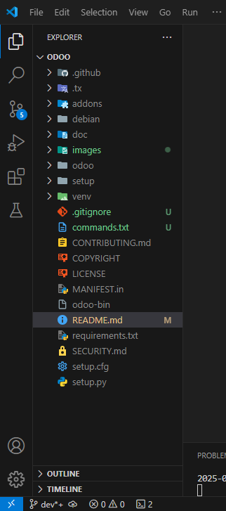
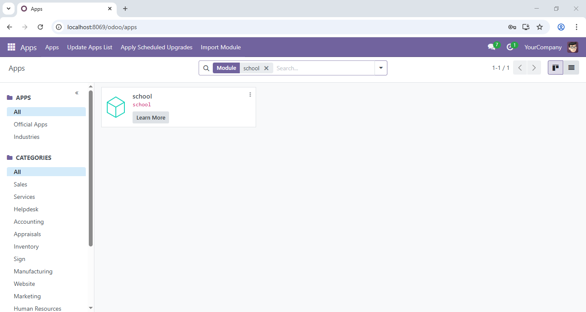
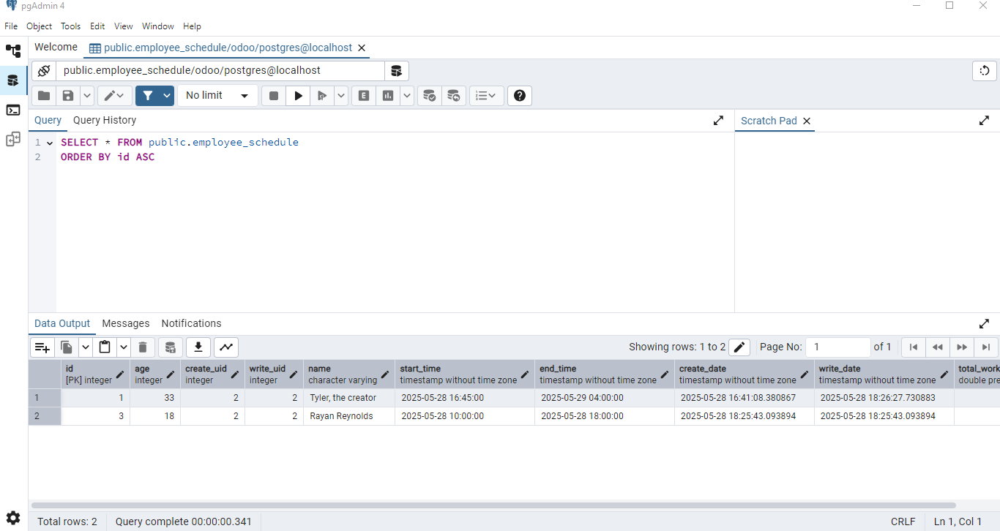

# Odoo

The modules built in this repository run on Odoo version 18.0, using PostgreSQL 17 as the database backend. The goal is to learn Odoo development, including custom modules, models, views, menus, security, and API usage. 

    
 

## Odoo Learning Repository

This repository only contains the directory where the modules or the custom code have been built. 

### Purpose

The goal of this project is to:
- Install and set up the environment, including configuring the PostgreSQL database to work with Odoo.

- Understand the architecture of Odoo, including its modular structure and framework.

- Learn how to use models, views, menus, security, and APIs in Odoo.

- Develop custom modules.

### Develop custom modules:

Learn and apply core Odoo components, such as:

- Models (data representation and business logic)

- Views (user interface design)

- Menus (navigation structure)

- Security (access control and user roles)

- APIs (external integrations and internal communication)